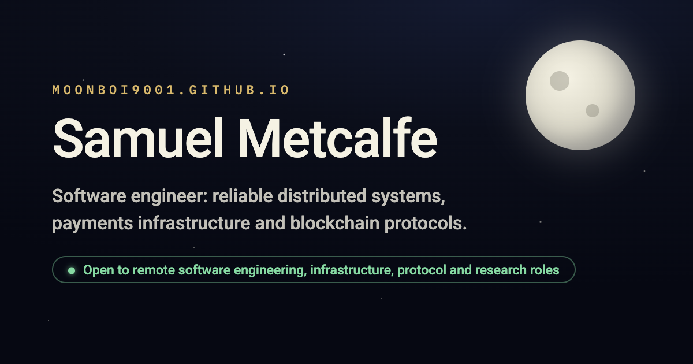

# MoonBoi9001.github.io

The source for my personal site, live at **[moonboi9001.github.io](https://moonboi9001.github.io)**.

I'm Samuel Metcalfe, a software engineer working on distributed systems, payments infrastructure and blockchain protocols. The site is a portfolio: selected work, where to find me elsewhere, and how to get in touch.

## Pages

- [Home](https://moonboi9001.github.io) (`index.html`): the portfolio itself.
- [The Graph Protocol contract map](https://moonboi9001.github.io/graph.html) (`graph.html`): an interactive map of how the protocol's contracts fit together.
- [A hardened home network edge](https://moonboi9001.github.io/network-edge.html) (`network-edge.html`): a reference architecture for a home firewall, filtered DNS, VPN-only remote access and intrusion detection.

## How it's built

Plain HTML, CSS and a little JavaScript, with no framework and no build step. GitHub Pages serves the files straight from this repository.

To view it locally, open `index.html` in a browser. The only tooling is a small Playwright suite that checks the home page's entrance animation; `npm install` then `npm test` runs it.
